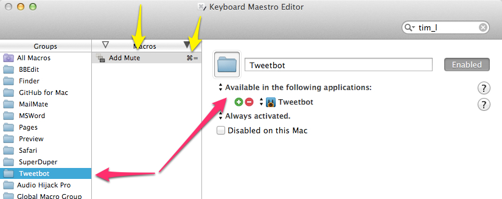
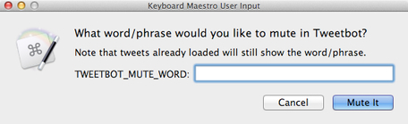
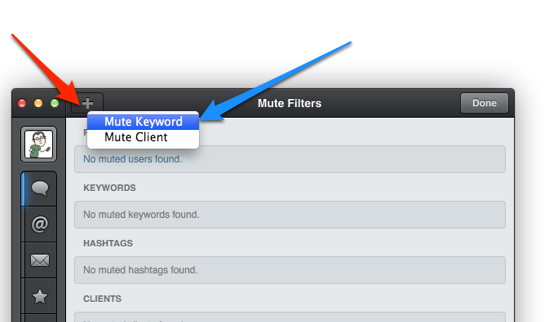

km-add-tweetbot-mute
====================

TL;DR: It's a [Keyboard Maestro] macro to add a keyword to the mute filter in [Tweetbot]. 

## Muting

I love me some Twitter, but I find that I get tired of the *meme de jour* topics fairly quickly.

Adding a new "mute keyword" to Tweetbot required way too many steps.

1. Switch to the "Mutes" tab
2. Click 'Edit'
3. Click '+'
4. Click "Mute Keyword"
5. Click inside the Keyword field because Tweetbot doesn't put you there automatically for some frustrating reason
6. Click "Save"
7. Click "Done"
8. Go back to the main timeline

That seems like 7 steps too many. Here's what I want:

Press a key combination, type a word/phrase, press enter.

### Wait! Too many, annoying, repetitive steps!? Automate it!

I made a new Macro Group in Keyboard Maestro which is only active when I am using Tweetbot (see red arrows in image below): 

That way any macros in that group (yellow arrows) will only be active in Tweetbot, and most importantly I can use any keyboard shortcut that isn't already in use in Tweetbot. I chose ⌘ + = because it seems like a good "Add" shortcut.

### Here are the steps ###

1. Prompt user for word/phrase to add to Tweetbot mute filter. (See Illustration #1 below.)
2. Select the "Mutes" item from the "Window" menu
3. Click the 'Edit' button
4. Click the mouse on the "+" button (see the red arrow on "Illustration #2: Add Filter" image below)
5. Press 'Enter' to select 'Mute Keyword (see the blue arrow on "Illustration #2: Add Filter" image below)
6. Press <kbd>Tab</kbd>  twice to get into the proper field to add the keyword(s) to be filtered
7. Paste the text that the user entered (see Important Note below)
8. Click 'Save' button
9. Click 'Done' button
10. Pause for 1.5 seconds to that I can see the new filter has been created
11. Go back to my Timeline (which is probably where I was reading when I decided I needed to mute something

## Screenshots ##

This is done immediately so that we don't take any action until the user confirms what they want to do or cancels it. 

It also means that I can add the word/phrase I want to mute while still looking at my timeline. This is particularly helpful if I need to verify the spelling of something.

First we need to click the + (red arrow) and then we need to select 'Mute Keyword" (blue arrow). 

The former is done by telling Keyboard Maestro to click at a certain point relative to the top-left corner of the front window. The latter is done by pressing <kbd>Enter</kbd> after the + button has been pressed.

## Important Note ##

When you mute a keyword, Tweetbot will let you 1) mute mentions, and 2) set how long you want the mute to be active (1 day, 1 week, 1 month, forever). I do not adjust these settings in this macro which (at least for me) appears to mean that mentions will not be muted and that the filter will be in place forever, which is what I want. I'm not sure if Tweetbot changes those settings based on your previous settings or not.

If you want something different, you can change those settings using Keyboard Maestro too. Doing so is left as an exercise to the reader.

## Why Tweetbot? ##

I'd much prefer to do this in [Twitterrific](http://iconfactory.com/software/twitterrific) but it doesn't have muting on the desktop *yet* so I'm using Tweetbot. These filters supposedly sync between the Mac and iOS client, but I use Twitterrific on iOS, so I can't say for sure how that works.

[Keyboard Maestro]: http://www.keyboardmaestro.com/main/

[Tweetbot]: http://tapbots.com/software/tweetbot/