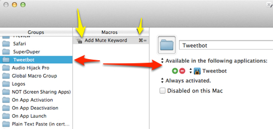

km-add-tweetbot-mute
====================

TL;DR: It's a [Keyboard Maestro] macro to add a keyword to the mute filter in [Tweetbot]. 

## Muting

I love me some Twitter, but I find that I get tired of the *meme de jour* topics fairly quickly.

Adding a new "mute keyword" to Tweetbot required way too many steps.

1. Switch to the "Mutes" tab
2. Click 'Edit'
3. Click '+'
4. Click "Mute Keyword"
5. Click inside the Keyword field because Tweetbot doesn't put you there automatically for some frustrating reason
6. Click "Save"
7. Click "Done"
8. Go back to the main timeline

That seems like 7 steps too many. Here's what I want:

Press a key combination, type a word/phrase, press enter.

### Wait! Too many, annoying, repetitive steps!? Automate it!

I made a new Macro Group in Keyboard Maestro which is only active when I am using Tweetbot (see red arrows in image below): 

That way any macros in that group (yellow arrows) will only be active in Tweetbot, and most importantly I can use any keyboard shortcut that isn't already in use in Tweetbot. I chose ⌘ + = because it seems like a good "Add" shortcut.

### Here are the steps ###

1. Prompt user for word/phrase to add to Tweetbot mute filter. (This is done first so that we don't take any action until the user confirms what they want to do or cancels it. It also means that I don't have to remember the word/phrase I want to mute for longer than a few seconds.)
2. Select the "Mutes" item from the "Window" 

(n.b.: I'd much prefer to do this in [Twitterrific](http://iconfactory.com/software/twitterrific) but it doesn't have muting on the desktop *yet* so I'm using Tweetbot.)

[Keyboard Maestro]: http://www.keyboardmaestro.com/main/

[Tweetbot]: http://tapbots.com/software/tweetbot/